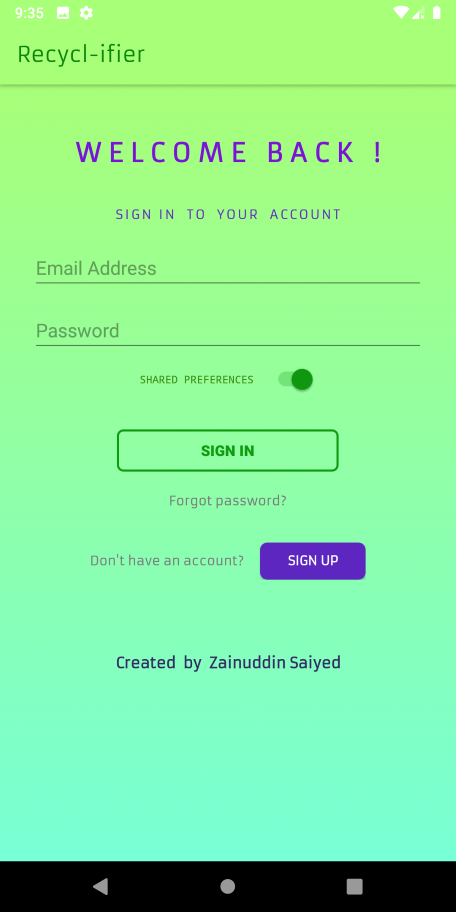
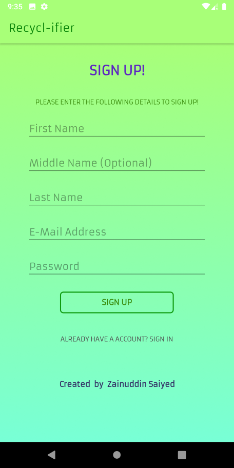
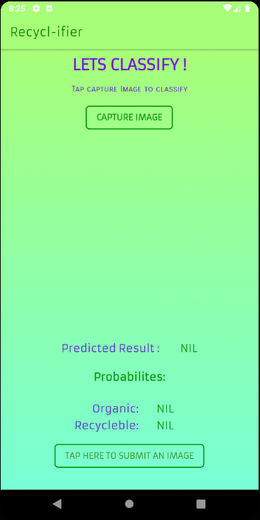
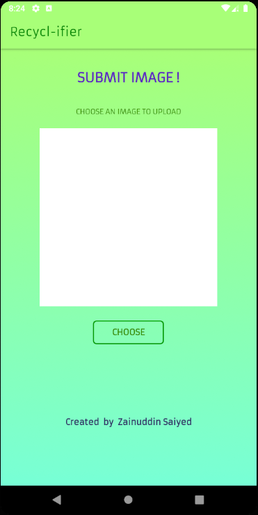
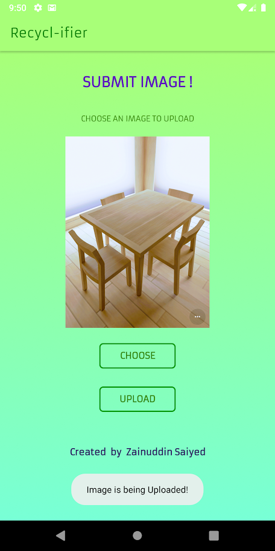

# Recycle-ifier:   
## Overview:
Recycle-ifier, is an android application which classifies whether the captured image contains Organic or Recycleable items and also outputs the coresponding probability of prediction. In addition to this users can also "Submit captured Images" to us, with which we can further optimize and improve the neural network model for better accuracy and predictions. The name Recycle-ifier is derived from two words which are- Recyclable and classifier. As the main function of the app is to classify if image has Recycleable or Organic items. 
  

  
*Short demo of the app:*
  

## Link to download APK: 
Click: [Download](https://drive.google.com/open?id=1rmyPLuIvagAQHsQx2Ga-yExYgheMz7kM)

## Guide on app's UI :

1. The following Welcome screen appears for few seconds when the apps launcher icon is tapped, followed by a Sign In page.
  

  

 
2. If the user is new and haven't yet registered, then press SIGN UP . Fill in the required details & tap Sign up button to get registered.
 

 
3. Enter your Log-In credentials to access app contents.
  

 
4. After Signing In, the Home page of app appears.
  

 
Here, Tap: Capture Image : To capture an image and predict the class of the Image. (Organic / Recycleable)
 Submit Image : To submit an image to us for further improving accuracy of predictions.
 
 
5. Optionally, For Submiting data, First press "Choose" button to browse and select an Image. 
  

 And, the press UPLOAD to upload the image.
  

 A small Toast appears at the bottom after successfull upload of image.
 

  

## Repository Contents:

1. Android Application ( Recycle-ifier android )
2. Python Notebooks ( jupyter notebook(s) used for training the Neural network )
3. App Screenshots. ( Images )

## Future Enhancements:
Adding prediction/detection of multiple items of different classes captured at realtime. It can also be used in an IOT based device too for further automating the process of waste segregation.
  
 

